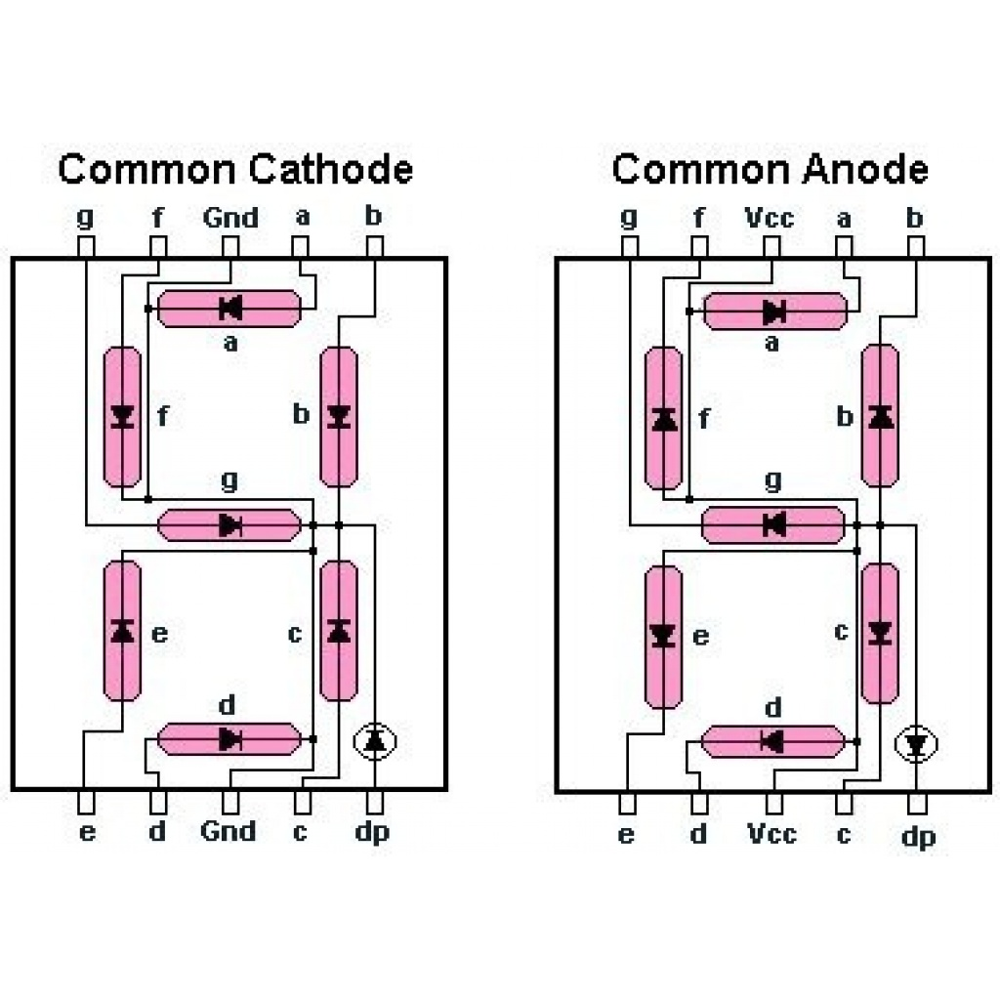
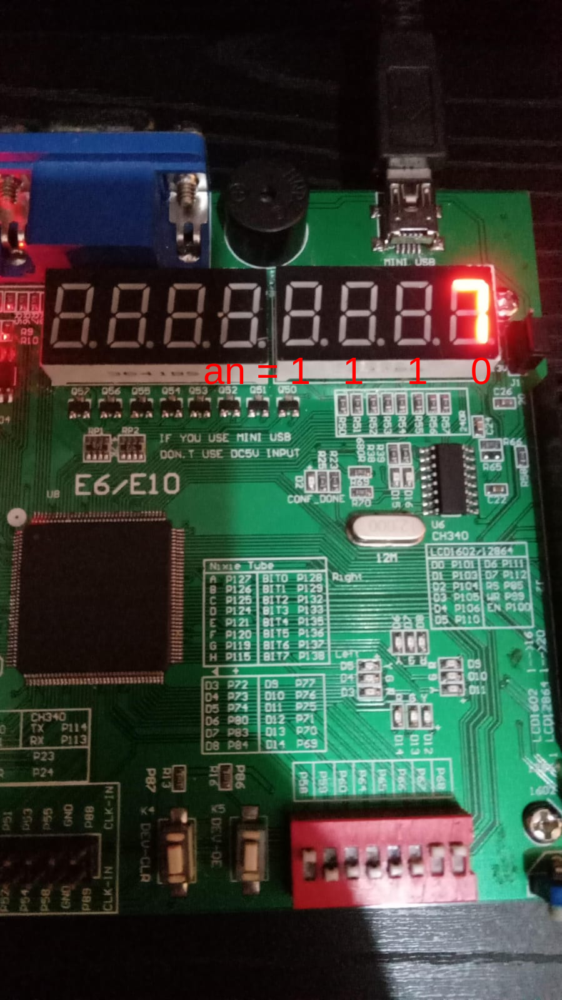
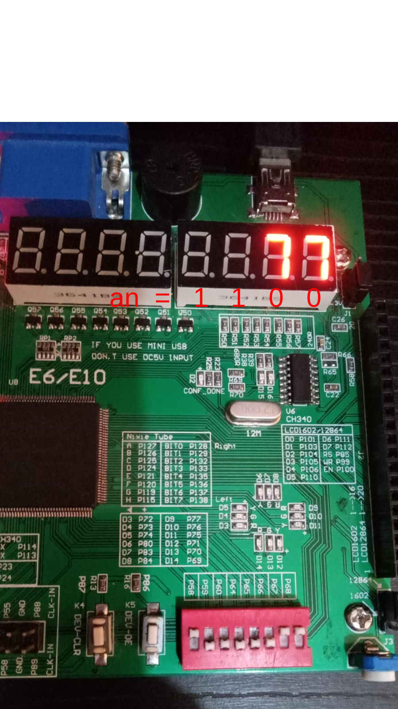
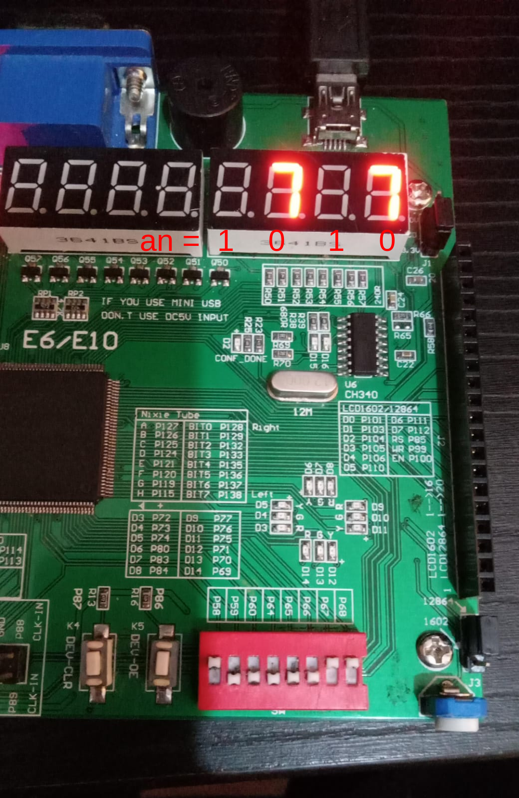
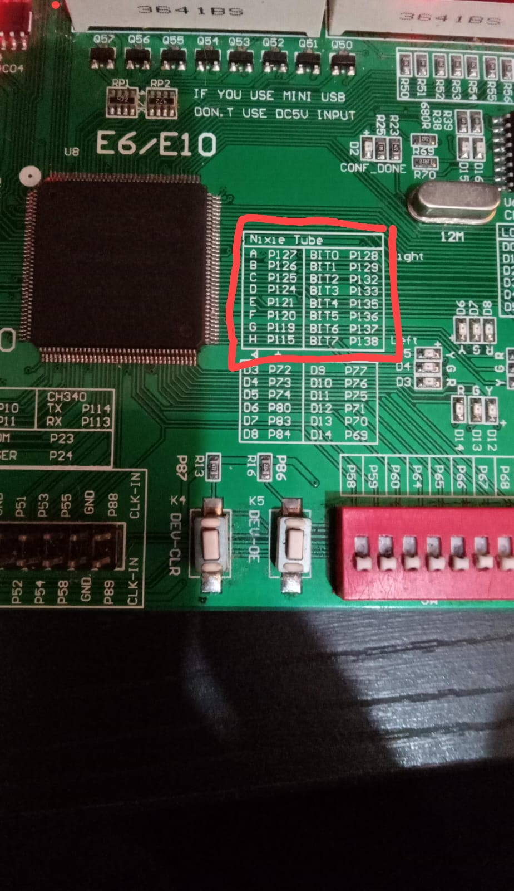

### Lab 03: Implemetación de 7 segmentos.

---

El objetivo de este laboratorio es lograr visualizar el resultado de un sumador de 3 bits en los display 7 segmentos que vienen en la tarjeta Altera.

**Display de 7 Segmentos:**

Para visualizar el resultado del sumador de 3 bits, se utilizarán los display de 7 segmentos. Este tipo de display consta de siete segmentos dispuestos en forma de "8", con cada segmento capaz de representar un dígito decimal o hexadecimal. Al iluminar combinaciones específicas de segmentos, podemos mostrar digitos del 0 al 9 en decimal o 0 al F en hexadecimal.





En el siguiente codigo se describe un modulo *BCDtoSSeg* que convierte un número BCD (Binary-Coded Decimal) de 4 bits en una señal adecuada para mostrar en un display de 7 segmentos.

```
module BCDtoSSeg (BCD, SSeg, an);

  input [3:0] BCD;
  output reg [0:6] SSeg;
  output [3:0] an;
  
  assign an = 4'b1110;


always @ ( * ) begin
  case (BCD)

                         // abcdefg
         4'b0000: SSeg = 7'b0000001; // "0"  
	 4'b0001: SSeg = 7'b1001111; // "1" 
	 4'b0010: SSeg = 7'b0010010; // "2" 
	 4'b0011: SSeg = 7'b0000110; // "3" 
	 4'b0100: SSeg = 7'b1001100; // "4" 
	 4'b0101: SSeg = 7'b0100100; // "5" 
	 4'b0110: SSeg = 7'b0100000; // "6" 
	 4'b0111: SSeg = 7'b0001111; // "7" 
	 4'b1000: SSeg = 7'b0000000; // "8"  
	 4'b1001: SSeg = 7'b0000100; // "9" 
   4'ha: SSeg = 7'b0001000;  
   4'hb: SSeg = 7'b1100000;
   4'hc: SSeg = 7'b0110001;
   4'hd: SSeg = 7'b1000010;
   4'he: SSeg = 7'b0110000;
   4'hf: SSeg = 7'b0111000;
    default:
    SSeg = 0;
  endcase
end

endmodule

```

En el modulo *BCDtoSSeg* se tiene la entrada **BCD** que define un puerto de entrada que representa un número en formato Binary-Coded Decimal de 4 bits.

**SSeg** es el puerto de salida que representa los segmentos de un display de siete segmentos. Se utiliza un registro (reg) para almacenar los valores de los segmentos.

**an** es un puerto de salida que controla los ánodos comunes de un display de siete segmentos, es decir permite encender cada uno de los 7-segmentos de la primera hilera de displays mediante un cero logico, por ejemplo:

**an = 1110:** Enciende el ultimo 7-segmentos de la primera hilera de la fpga.



**an = 1100:** Enciende los 2 ultimos 7-segmentos de la primera hilera de la fpga.



**an = 1010:** Enciende el segundo y el ultimo 7-segmentos de la primera hilera de la fpga.



Para realizar la conexión de los 7-segmentos en la FPGA, revisar en la carpeta recursos del repositorio el archivo *Pin_planner* ó guiarse del siguiente recuadro que encontran en la FPGA:





------------

**Primera Parte**

Cada grupo debe lograr visulizar, en un display de 7 segmentos, los numeros del 0 a F, formato hexadecimal, ingresando por medio de los switch cada uno de los números, asi mismo modificar el codigo para poder visualizar solo los números del 0 al 9. Tambien deben poder visualizar en el simulador, el correcto funcinamiento del código.

**Segunda Parte**

Cada grupo debe lograr visulizar, en un display de 7 segmentos, la suma de dos números de 3 bits, ingresados mediante los switch de la FPGA, tanto en forma hexadecimal como en forma decimal. Tambien deben poder visualizar en el siulador, el correcto funcinamiento del código.


### Entregables.

Se debe subir al repositorio de cada uno de los grupos una carpeta con el nombre "*lab003*" que contenga:

* Un archivo "*readme_l03.md*" donde se describa el procedimiento detallado de la realización del laboratorio.
* Una carpeta "*Imagenes*" donde se ecnuentren las figuras utilizadas en la documentación del archivo "*readme_l03.md*".
* Una carpeta "*src*" que contenga los archivos de código ".v" o ".vhdl", de las descripción del display 7 segmentos y el sumador de 3 bits.
* Links de videos donde se debe mostrar el funcionamiento del 7 segemtos y del sumador de 3 bits (deben agregarlo en el archivo "*readme_l03.md*").

Estos archivos deben ser subidos al repositorio antes del dia <strong>31 de Marzo del 2024</strong>.