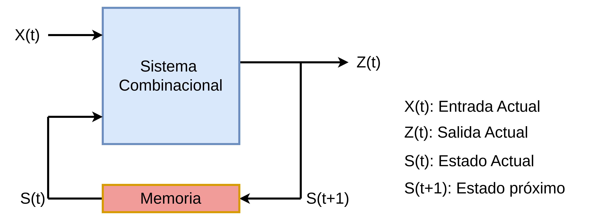

### Lab 04: Contador de segundos, décimas y centésimas de segundos.
---

El objetivo de este laboratorio es implementar un contador de segundos, décimas y centésimas de segundos en el display de 7 segmentos.

### Lógica secuencial

La lógica secuencial es una rama de la electrónica digital que se ocupa de los sistemas cuyo comportamiento depende no solo de las entradas actuales, sino también de la historia previa de las entradas. A diferencia de la lógica combinacional, donde la salida depende únicamente de las entradas actuales, en la lógica secuencial, la salida puede variar en función de las secuencias de entradas anteriores.

### Componentes y Principios Claves

**Flip-Flops y Biestables:** Los flip-flops son los bloques fundamentales de la lógica secuencial. Son circuitos que pueden almacenar un bit de información, manteniendo su estado hasta que sean activados por una señal de reloj. Los tipos más comunes incluyen el flip-flop tipo D, tipo T, tipo SR y tipo JK.

**Registros:** Son conjuntos de flip-flops utilizados para almacenar múltiples bits de información. Los registros pueden desplazarse, lo que permite mover datos de un flip-flop a otro dentro del registro, una operación común en muchos sistemas digitales.

**Contadores:** Son circuitos que utilizan una serie de flip-flops para contar pulsos de reloj. Pueden contar en una secuencia binaria, decimal u otras configuraciones.

**Divisor de frecuencia**

Un divisor de frecuencia es un circuito que devuelve como salida una señal de frecuencia menor que la señal de entrada. Un divisor de frecuencia se puede construir usando un contador módulo N y conectando la señal que se quiere dividir a la entrada de reloj del contador. De esta forma, cuando se llegue al último estado de la cuenta (N-1) se generará un pulso en la salida y esta  salida generada tendrá una frecuencia N veces menor que el reloj de entrada.

En la imagen anterior se puede apreciar la señal clk que corresponde al reloj del sistema, la señal de reset (rst) que inicializa las variables en cero, la señal counter que hace un conteo hasta 5, luego se reinicia y la señal "fdiv" que  es una nueva señal de reloj cuya frecuencia es 5 veces menor que la señal clk.

----------------

**Máquinas de Estado Finito (FSM):** Las FSM son modelos matemáticos que describen un sistema en términos de estados y transiciones entre esos estados. Se utilizan ampliamente para diseñar y analizar sistemas digitales y programas de software.

### Actividad. 

Se debe crear un contador de segundos, décimas de segundo, centésimas de segundos y milésimas de segundos, el cual debe poder ser visualizado en el display de 7 segmentos que trae la FPGA. Esta cuanta debe hacerse desde 0 hasta 9999, como se muestra en el siguiente [video](https://youtu.be/N6tfK1eepyU).

El sistema debe contar con dos switch que permitan elegir entre cada uno de los casos de conteo ya mencionados y una lógica de reset que permita mediante un botón, reiniciar el contador a cero.

### Entregables.

Se debe subir al repositorio de cada uno de los grupos una carpeta con el nombre "*lab004*" que contenga:

* Un archivo "*readme_l04.md*" donde se describa el procedimiento detallado de la realización del laboratorio.
* Una carpeta "*Imagenes*" donde se encuentren las figuras utilizadas en la documentación del archivo "*readme_l03.md*".
* Una carpeta "*src*" que contenga los archivos de código ".v" o ".vhdl", de las descripción del display 7 segmentos y el sumador de 3 bits.
* Links de videos donde se debe mostrar el funcionamiento del 7 segmentos y del sumador de 3 bits (deben agregarlo en el archivo "*readme_l03.md*").

Estos archivos deben ser subidos al repositorio antes del dia <strong>4 de Agosto del 2024</strong>.