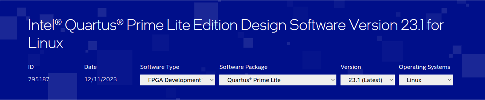
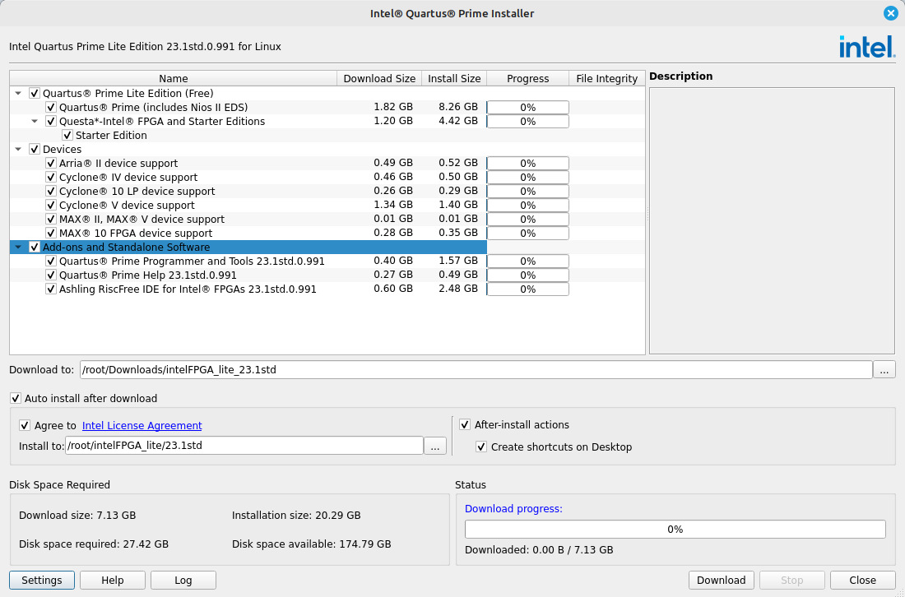

##  Electrónica Digital I (2016499) 
## Grupos 1 y 2

### Profesor:
	Jhon Alexander Ramirez Martinez 
    Ingeniero electrónico
	Correo:jharamirezma@unal.edu.co.

	

### Descripción

Bienvenidos al laboratorio de electrónica digital 1!

Este laboratorio está diseñado para proporcionar los conocimientos y habilidades necesarias para realizar la construcción de un sistema digital, desde la descripcion mediante lenguajes HDL, simulación e implementación sobre tarjetas de desarrollo FPGA.


### Metodología

Se realizaran 5 talleres de laboratorio enfocados hacia el desarrollo de un proyecto que permita la creacion de un sistema digital construido sobre una FPGA.

### Herramientas


**Distribuciones de Linux**

Es necesario realizar el trabajo en este curso sobre una distribución de Linux, en este [enlace](https://www.youtube.com/watch?v=zfAXUcq-frs) encontraran un tutorial de cómo realizar la preparación e instalación de Ubuntu, aunque son libres de elegir una distribución diferente. 

Se recomienda trabajar sobre alguna de las siguientes distribuciones.

+ [Mint](https://www.linuxmint.com/download.php)
+ [Ubuntu](https://ubuntu.com/download) 


**Github**

Es necesaria la creación de una cuenta en Github, para lo cual pueden seguir las siguientes [indicaciones](https://www.youtube.com/watch?v=Gn3w1UvTx0A).

Posterior a la creación de la cuenta deben instalar Git en sus computadores. Para realizar la instalación de git, se pueden guiar por el tutorial en este [enlace](https://www.hostinger.co/tutoriales/instalar-git-en-distintos-sistemas-operativos):


**Entornos de desarrollo IDE**

+ Vivado (Nexys y Zybo)
+ Quartus (Altera)
+ yosys 


**Editores de codigo**

+ Visual code studio
+ Atom
+ Vim
+ Sublime Text
+ Eclipse + PyDev


**Instalación de Quartus (para Altera)**

En  este [enlace](https://www.intel.la/content/www/xl/es/products/details/fpga/development-tools/quartus-prime/resource.html) encontraran la web de donde se decarga el instalador de Quartus. Seleccionamos la version *"Lite edition"* y dar clic en ir a la descarga. Los opciones de cómo se debe realizar la descarga se muestran en la siguiente imagen:



El archivo de descarga es el instalador y tiene la extención .run. Para correr el instalador de Quartus se debe:

   1. Abrir la terminal en la capeta donde se encuentra el instalador y cambiar los permisos del archivo corriendo el siguiente comando:
```
chmod +x *.run
```
Donde * es el nombre del archivo descargado. 


  2. Correr el instalador con el siguiente comando, con la terminal abierta en la carpeta del archivo: 

```
./*.run
```
  3. Se abrira el instalador como se muestra en la siguiente imagen, deben seleccionar todo como se muestra y dan desacargar.



Cuando la instalación finalice, en el escritorio encontraran un acceso directo del programa. Tambien pueden abrir el programa desde la terminal de Linux realizando los siguientes pasos:

1. Se debe editar el archivo *.bashrc* que podran encontrar en la siguiente dirección: 

```
/home/usuario*
```

  Donde *usuario corresponde a la carpeta de usuario de cada uno de ustedes.

2. Pegar la siguiente linea de codigo al final del archivo *.bashrc*:

```
    export ALTERAPATH="/home/user*/intelFPGA_lite/23.1std/"
    export QUARTUS_ROOTDIR=${ALTERAPATH}/quartus
    export QUARTUS_ROOTDIR_OVERRIDE="$QUARTUS_ROOTDIR"
    export PATH=$PATH:${ALTERAPATH}/quartus/sopc_builder/bin
    export PATH=$PATH:${ALTERAPATH}/nios2eds/bin
    export PATH=$PATH:${QSYS_ROOTDIR}
```

Donde deben cambiar en el codigo "*user* *" por el nombre de usuario del computador.

1. Comentar en el *.bashrc* la sentencia *export QSYS_ROOTDIR="/home/user**/intelFPGA_lite/23.1std/quartus/sopc_builder/bin"*, agregando el caracter "#" al principio de la linea, es decir la linea debe quedar de la siguiente manera:

```
#export QSYS_ROOTDIR="/home/alex/intelFPGA_lite/23.1std/quartus/sopc_builder/bin"
```
4. Correr en la terminal el siguiente comando:

```
sudo ln -s $QUARTUS_ROOTDIR/bin/quartus /bin/quartus
```

Ahora podrán correr la IDE usando el comando ```quartus``` en la terminal.


## Tutorial para la herramienta de simulación Questa

### Descargar instalador

* Descargar los archivos Questa*-Intel® FPGA Edition (includes Starter Edition) del siguiente [link](https://www.intel.com/content/www/us/en/software-kit/776289/questa-intel-fpgas-pro-edition-software-version-23-1.html). Se debe descarga tanto el archivo con extensión ```.run``` como la parte II que tiene extensión ```.qdz``` en el mismo directorio.
* Tenga en cuenta que la descarga de estos archivos tomará tiempo.
* Para el presente tutorial se descargó la versión 23.1.

###  Instalación

* En la terminal de linux:

 ```
    chmod +x nombre_archivo.run
    ./nombre_archivo.run
```

* Se abrirá el instalador (ver imagen).

     


    - Dar click en siguiente y seleccionar la opción ```Questa - Intel FPGA Starter Edition```.

    - Dar click en siguiente y aceptar los términos y condiciones.

    - Dar click en siguiente y seleccionar la carpeta de destino de la instalación.

    - Dar click en siguiente y revisar el resumen.

    - Dar click en siguiente con lo cual empezará la instalación 

### Descargar y configurar la licencia

Es necesario descargar la licencia de Questa para lo cual se debe:

* Ingresar al Self-Service Licensing Center de Intel en el siguiente [link](https://licensing.intel.com/psg/s/?language=en_US).

* Inscribirse en la opción [Enroll for Intel® FPGA Self Service Licensing
Center (SSLC)](https://www.intel.com/content/www/us/en/secure/forms/fpga-sslc-registration.html). 

* Loggerase en la opción [Already enrolled ? - Sign In here ](https://login.microsoftonline.com/46c98d88-e344-4ed4-8496-4ed7712e255d/oauth2/authorize?client_id=2793995e-0a7d-40d7-bd35-6968ba142197&redirect_uri=https%3A%2F%2Flauncher.myapps.microsoft.com%2Fapi%2Fsignin-oidc&response_type=code&scope=openid%20profile%20offline_access&code_challenge=l621EbMpMd8XCMUt32fOkdVx4LQ85OhcOiA9DS9mPMQ&code_challenge_method=S256&response_mode=form_post&nonce=638435098500409634.ZjJmMDY1YzYtZjM0OC00YmIxLWI4NWUtNTlkMmU0MGJjYzgxZmY1ZjkyNDgtOGIxOS00YmEyLTk1ZjctODIxOGQ1ZjYwMjA4&client_info=1&x-client-brkrver=IDWeb.2.13.2.0&state=CfDJ8E3NALe6oY1JvkTnnsQsCGyFKIDx-4SbDtmZoJPUlgmKjsHRPSR5otWRAPY5N420c27dON5pWiPUFCv8RYxYwnS4IEfWxDcSsGyPwd4qgm_yFUW2Oc6q80X7YhH4M6Qm0icDBQ4KM6MI5OzEtjYAfBNwkfCX42xjVa3wP9qfIrf5Pr9UpIKnh2Ao2bzxA05ltw07cQHfXxGVB4qWp75KPYLx1aplPrnEREmGZy_KRilW6ix08U5NCks8Y4ASbS2-LGUwR_HW6T163bZ8VvyPvFScu6rkH00tmrEEkvZ6EHNfnv9kpGW-CV_s2XG4xsm31sXMnamANcz5UcfPxQ3FW2k_y2X1tS7ckJu25ZbLLL98pTZ8rMueWU26653lNGb40l-6c1hmipyOPaWbfWtrfCq6IPKikdz_drSK3InXvBPoayBqA3UCZ-0bzxFzVDC1g3qFaycOLCFha2bAOn27QuT6xqexH-AZxmfCwnahlTfd3jJUCVaZ6Tvs17YtZT7R_CKJbsQr2BWkvql8oEUB7OI&x-client-SKU=ID_NET6_0&x-client-ver=6.35.0.0) (Intel Azure Portal). 
    - Se deben seguir todos los pasos, uno de ellos consiste en escanear un código QR, en caso de no ser posible usar la opción ```I want to set up a different methode```,  con la cual se enviará un código  como mensaje de texto al número de celular que se ingrese.

    - Leer y aceptar términos de uso.

* Una vez realizados los anteriores pasos, se abrirá el siguiente portal:

     

    - Ingresar a la opción ```Sing up for Evaluation or No-Cost License```.


    - Seleccionar la opción ```Questa*-Intel® FPGA Starter``` (ver imagen) y dar click en siguiente.

     

    - Se abrirá una interfaz para generar la licencia (ver imagen).

     

    - Dar click en ```+New Computer```.

    - Diligenciar los campos requeridos:
        
        - En ```License type``` seleccionar FIXED.

        - En ```Computer type``` seleccionar NIC ID.

        - Para saber el  ```Primary Computer ID```:

            En una terminal de Linux escribir el comando ```ifconfig```.

            El NIC ID corresponde al número de la mac del driver de wifi o ethernet, para wifi aparecerá en la opción ```wlp1s0``` junto a la palabra ```ether```.

            Copiar todo el string que está separado por dos puntos ":", pero en la casilla ```Primary Computer ID``` borrarlos, es decir, sólo dejar caracteres alfanuméricos.

         - Dar click en ```save```, aceptar términos de uso y dar click en ```generar```.

    - Recibirán un correo con un archivo adjunto con extensión ```.dat```  correspondiente a la licencia.

    - Descargar la licencia en el directorio de instalación.

* Configurar la licencia en la IDE de Quartus:

    - En el menú ```Tools``` abrir el ```License setup```.

    - En la casilla ```License file``` cargar el archivo de la licencia ```.dat``` que acabaron de generar.

*  Configuración de variables de entorno de la licencia:

    En el archivo ```.bashrc```: 


    ```
    export LM_LICENSE_FILE=path_del_archivo/nombre_archivo.dat
    ```


## Préstamo de equipos LABDIEE

En la carpeta labDIEE_2024_1 encontrarán varios archivos relacionados al Laboratorio del Departamento de Ingeniería Eléctrica y Electrónica. El archivo FORMATO_Movimiento_transitorio_bienes-LABDIEE-2024-1.xlsm contiene el formato que deben diligenciar para que puedan adelantar el préstamo de equipos en casa. Por grupo de trabajo deben llevar al almacén el formato diligenciado, una copia del mismo y la fotocopia del carnet del integrante que vaya a figurar como el responsable de los equipos, quien será el encargado de recibirlos. Revisen todos los archivos de la carpeta, ya que encontrarán los horarios del almacén, el listado de equipos según la asignatura y las fechas de recepción de formatos y entrega de equipos, así como información relevante del laboratorio.

 
## Notas*


**GRUPO 1 (Miercoles 9 - 11)**

<table>
	<tbody>
		<tr>
			<td colspan="2" rowspan="2"> <strong> GRUPO 1 </strong></td>
			<td colspan="4"> <center> <strong> NOTAS </strong></center> </td>
		</tr>
		<tr>
			<td><strong>LAB00</strong></td>
			<td><strong>LAB01</strong></td>
			<td><strong>LAB02</strong></td>
			<td><strong>LAB03</strong></td>
		</tr>
		<tr>
			<td colspan="2">Equipo 1</td>
			<td></td>
			<td></td>
			<td></td>
			<td></td>
		</tr>
		<tr>
			<td colspan="2">Equipo 2</td>
			<td></td>
			<td></td>
			<td></td>
			<td></td>
		</tr>
	</tbody>
</table>


**GRUPO 2 (Lunes 9 - 11)**

<table>
	<tbody>
		<tr>
			<td colspan="2" rowspan="2"> <strong>GRUPO 2 </strong>
</td>
			<td colspan="4"> <center> <strong> NOTAS </strong> </center> </td>
		</tr>
		<tr>
			<td><strong>LAB00</strong></td>
			<td><strong>LAB01</strong></td>
			<td><strong>LAB02</strong></td>
			<td><strong>LAB03</strong></td>
		</tr>
		<tr>
			<td colspan="2">Equipo 1</td>
			<td></td>
			<td></td>
			<td></td>
			<td></td>
		</tr>
		<tr>
			<td colspan="2">Equipo 2</td>
			<td></td>
			<td></td>
			<td></td>
			<td></td>
		</tr>
		<tr>
			<td colspan="2">Equipo 3</td>
			<td></td>
			<td></td>
			<td></td>
			<td></td>
		</tr>
		<tr>
			<td colspan="2">Equipo 4</td>
			<td></td>
			<td></td>
			<td></td>
			<td></td>
		</tr>
	</tbody>
</table>

<strong>*</strong>Las notas consignadas en la tabla son del trabajo general de cada grupo, pero la nota individual queda sujeta a participación en el repositorio de cada integrante.